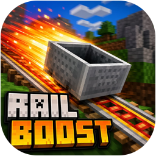



  

<h1 align="center">Rail Boost Plugin</h1>

  <b>A comprehensive minecart enhancement system for Minecraft servers.</b> 
  <b>Speed control, auto-pickup, built-in storage, preset system, and advanced physics.</b>

  &nbsp;&nbsp;&nbsp;&nbsp;&nbsp;&nbsp;&nbsp;&nbsp;&nbsp;&nbsp;&nbsp;&nbsp;

Rail Boost is an open-source Minecraft plugin that transforms vanilla minecart transportation into a fully configurable preset-driven system. Each minecart can be configured with six speed levels, automated item collection, optional particle and magnet effects, chunk loading behavior, and shared preset storage managed through named preset sticks. The plugin also adds rail safety checks and speed handling so minecarts travel more reliably across complex track networks.

### **Core Features**

- **Speed Control:** Six configurable speed levels (0.25x to 4.0x) with intelligent physics handling for curves, uphill sections, and speed transitions
- **Auto-Pickup System:** Automatic item collection within a configurable radius (1--5 blocks) with per-cart blacklist filtering for precise control
- **Preset-Linked Shared Storage:** Minecarts with presets use shared preset storage inventories (54 slots) that can be opened and managed via commands
- **Preset System:** Create, save, and share named minecart configurations using sticks -- apply saved presets to any cart via right-click
- **Predefined Presets:** Three built-in standard presets for common use cases -- Speed, Collector, and Magnet configurations
- **Advanced Physics:** Enhanced curve navigation, uphill momentum preservation, multi-block position checking, and anti-stuck mechanisms for smooth travel
- **Magnetism System:** Optional minecart-to-minecart attraction for forming train convoys with intelligent collision prevention
- **Visual Effects:** Customizable particle trails with intensity scaling based on speed and multiple particle type options
- **Real-Time Speedometer:** BossBar display showing current velocity in km/h with color-coded speed indicators
- **Chunk Loading:** Automatic chunk force-loading with timed unloading to ensure smooth travel across unloaded areas
- **F-Key Access:** Open storage and hopper inventories while seated in a minecart using the F key
- **Persistent Configuration:** All per-cart settings and preset data are saved to YAML and persist across server restarts

### **Supported Platforms**

- **Server Software:** `Spigot`, `Paper`, `Purpur`, `CraftBukkit`
- **Minecraft Versions:** `1.16` and higher
- **Java Requirements:** `Java 17+`

### **Installation**

1. Download the latest `.jar` from the [Releases](https://github.com/Cobbleworks/Rail-Boost-Plugin/releases) page
2. Stop your Minecraft server
3. Copy the `.jar` into your server`s `plugins/` folder
4. Start your server
5. Use commands to create/edit presets; data is persisted in `plugins/RailBoost/presets.yml`

### **Commands**

| Command | Description |
|---------|-------------|
| `/railboost help` | Show command help |
| `/railboost preset <name>` | Give yourself a preset stick for an existing preset |
| `/railboost give <player> <preset>` | Give another player a preset stick |
| `/railboost create <name>` | Create a new preset with default settings |
| `/railboost edit <preset> <setting> <value>` | Edit one setting on a preset |
| `/railboost edit <preset> storage` | Open shared storage inventory for a preset |
| `/railboost list` | List all available presets with summary settings |
| `/railboost delete <preset>` | Delete a preset |

**Aliases:** `/rb`, `/boost`

### **Preset Edit Settings**

Use `/railboost edit <preset> <setting> <value>` with these options:

| Setting | Value | Description |
|---------|-------|-------------|
| `speed` | `1..6` | Speed level (`1=Slow`, `6=Ultra Fast`) |
| `autopickup` | `true/false` | Toggle item auto-pickup |
| `radius` | `1..5` | Auto-pickup radius |
| `speedometer` | `true/false` | Toggle BossBar speedometer |
| `chunkload` | `true/false` | Toggle temporary force-loading of traversed chunks |
| `magnet` | `true/false` | Toggle minecart magnetism behavior |
| `effects` | `true/false` | Toggle particle trail effects |
| `effecttype` | Bukkit particle name | Set particle type (for example `FLAME`, `END_ROD`) |
| `blacklist` | `add/remove <material>` | Add/remove material from auto-pickup blacklist |
| `storage` | none | Open shared storage GUI for this preset |

### **How It Works**

- Create or edit a preset
- Get a preset stick with `/railboost preset <name>`
- Right-click a minecart while holding the stick to apply settings
- Settings are written to minecart persistent data and used by movement/pickup/effects systems
- Minecarts with the same preset name share the same preset storage inventory

### **Data Storage**

Rail Boost stores preset definitions in `plugins/RailBoost/presets.yml`.

Each preset entry contains:

| Key | Type | Description |
|-----|------|-------------|
| `name` | string | Display name of preset |
| `speed` | int | Speed level `1..6` |
| `autopickup` | boolean | Auto-pickup enabled flag |
| `pickupRadius` | int | Pickup radius `1..5` |
| `speedometer` | boolean | BossBar speed display flag |
| `chunkload` | boolean | Chunk loading flag |
| `magnet` | boolean | Magnet mode flag |
| `effects` | boolean | Particle effects flag |
| `effectType` | string | Bukkit particle type |
| `blacklist` | list | Material names blocked from auto-pickup |

Default presets created by the plugin:

| Preset | Defaults |
|--------|----------|
| `speed` | `speed=4`, `speedometer=true` |
| `collector` | `autopickup=true`, `pickupRadius=4`, `speed=2` |
| `magnet` | `magnet=true`, `speed=3`, `effects=true` |

### **Permissions**

| Permission | Description | Default |
|------------|-------------|---------|
| `railboost.use` | Allows use of RailBoost features | `true` |
| `railboost.admin` | Administrative access to RailBoost | `op` |

### **Behavior Notes**

- `VehicleMoveEvent` applies auto-pickup, chunk-loading, effects, and speed logic continuously
- Speed levels map to velocity factors: `0.4`, `0.8`, `1.2`, `2.0`, `3.0`, `4.0`
- Speed boosting is applied only when the track ahead is considered straight/safe
- Storage and hopper minecarts can be opened while riding via the F key (swap-hand event)
- Minecart settings are stored in entity persistent data under plugin key `settings`
- Permissions are declared in `plugin.yml`; command handlers currently do not enforce explicit permission checks in code

### **License**

This project is licensed under the **MIT License** -- see the [LICENSE](LICENSE) file for details.

## **Screenshots**

The screenshots below demonstrate Rail Boost Plugin across several scenarios, including preset storage management, speed presets, particle effects, and the real-time speedometer.

<table>
  <tr>
    <th>Rail Boost - Preset Storage</th>
    <th>Rail Boost - Speed Preset</th>
  </tr>
  <tr>
    <td></td>
    <td></td>
  </tr>
  <tr>
    <th>Rail Boost - Portal Particles</th>
    <th>Rail Boost - Collector Preset</th>
  </tr>
  <tr>
    <td></td>
    <td></td>
  </tr>
  <tr>
    <th>Rail Boost - Speedometer</th>
    <th>Rail Boost - Magnetic Carts</th>
  </tr>
  <tr>
    <td></td>
    <td></td>
  </tr>
</table>